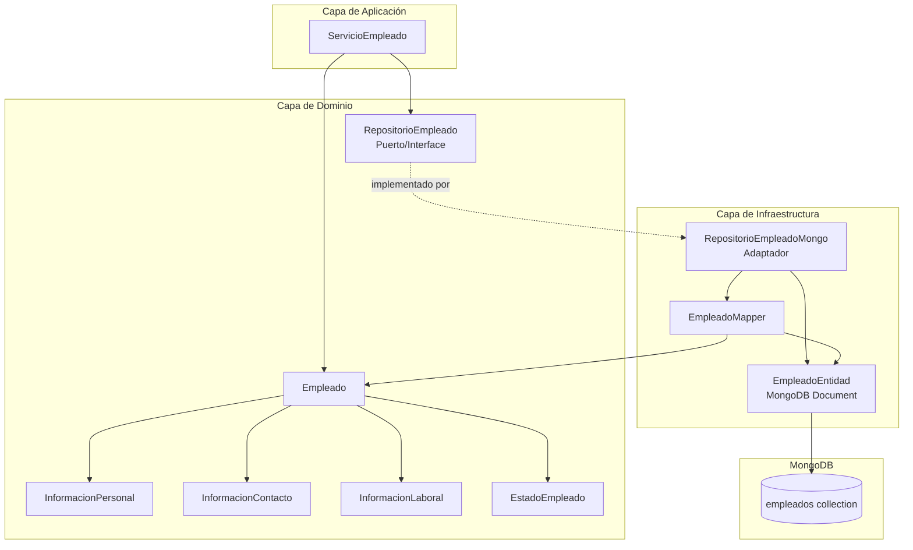

# Arquitectura del Microservicio de Gestión de Personal

## Arquitectura Hexagonal + DDD

Este microservicio sigue los principios de **Arquitectura Hexagonal** (Ports & Adapters) y **Domain-Driven Design (DDD)** para mantener una clara separación de responsabilidades y facilitar la evolución del sistema.

## Diagrama de Arquitectura



## Capas de la Arquitectura

### 1. Capa de Dominio (Core)
**Ubicación:** `devbitsve.dominio`

Contiene la lógica de negocio pura, independiente de frameworks y tecnologías:

- **Entidades:** [Empleado](file:///c:/Users/marco/Documents/ADA/personal-empleados/src/main/java/devbitsve/dominio/modelo/Empleado.java) - Agregado raíz
- **Value Objects:** 
  - [InformacionPersonal](file:///c:/Users/marco/Documents/ADA/personal-empleados/src/main/java/devbitsve/dominio/modelo/InformacionPersonal.java)
  - [InformacionContacto](file:///c:/Users/marco/Documents/ADA/personal-empleados/src/main/java/devbitsve/dominio/modelo/InformacionContacto.java)
  - [InformacionLaboral](file:///c:/Users/marco/Documents/ADA/personal-empleados/src/main/java/devbitsve/dominio/modelo/InformacionLaboral.java)
- **Enums:** [EstadoEmpleado](file:///c:/Users/marco/Documents/ADA/personal-empleados/src/main/java/devbitsve/dominio/modelo/EstadoEmpleado.java)
- **Puertos:** [RepositorioEmpleado](file:///c:/Users/marco/Documents/ADA/personal-empleados/src/main/java/devbitsve/dominio/puerto/RepositorioEmpleado.java) - Interface

### 2. Capa de Aplicación
**Ubicación:** `devbitsve.aplicacion`

Orquesta los casos de uso del sistema:

- **Servicios:** [ServicioEmpleado](file:///c:/Users/marco/Documents/ADA/personal-empleados/src/main/java/devbitsve/aplicacion/servicio/ServicioEmpleado.java)
  - Crear empleado
  - Buscar empleados
  - Actualizar información
  - Cambiar cargo (con historial)
  - Gestionar estados
  - Eliminar empleado

### 3. Capa de Infraestructura
**Ubicación:** `devbitsve.infraestructura`

Implementa los adaptadores para tecnologías específicas:

- **Persistencia MongoDB:**
  - [EmpleadoEntidad](file:///c:/Users/marco/Documents/ADA/personal-empleados/src/main/java/devbitsve/infraestructura/persistencia/entidad/EmpleadoEntidad.java) - Documento MongoDB
  - [RepositorioEmpleadoMongo](file:///c:/Users/marco/Documents/ADA/personal-empleados/src/main/java/devbitsve/infraestructura/persistencia/repositorio/RepositorioEmpleadoMongo.java) - Adaptador
  - [EmpleadoMapper](file:///c:/Users/marco/Documents/ADA/personal-empleados/src/main/java/devbitsve/infraestructura/persistencia/mapper/EmpleadoMapper.java) - Conversión de datos

## Principios Aplicados

### Inversión de Dependencias
El dominio define interfaces (puertos) que la infraestructura implementa (adaptadores). El dominio **no depende** de la infraestructura.

### Separación de Responsabilidades
- **Dominio:** Lógica de negocio y reglas
- **Aplicación:** Orquestación de casos de uso
- **Infraestructura:** Detalles técnicos (BD, APIs, etc.)

### Modelo de Dominio Rico
Las entidades contienen comportamiento, no solo datos:
- Validaciones en constructores
- Métodos de negocio (`cambiarCargo()`, `desactivar()`, etc.)
- Inmutabilidad en Value Objects

## Flujo de Datos

```
API REST (futuro)
    ↓
ServicioEmpleado (Aplicación)
    ↓
Empleado (Dominio)
    ↓
RepositorioEmpleado (Puerto)
    ↓
RepositorioEmpleadoMongo (Adaptador)
    ↓
MongoDB
```

## Beneficios de esta Arquitectura

1. **Testabilidad:** Fácil crear tests unitarios del dominio sin BD
2. **Mantenibilidad:** Cambios en infraestructura no afectan el dominio
3. **Flexibilidad:** Fácil cambiar de MongoDB a otra BD
4. **Claridad:** Separación clara de responsabilidades
5. **Evolución:** Agregar nuevas funcionalidades sin romper existentes

## Próximos Pasos

- [ ] Agregar capa de presentación (REST API)
- [ ] Implementar DTOs para entrada/salida
- [ ] Agregar validaciones con Bean Validation
- [ ] Implementar manejo de errores global
- [ ] Agregar seguridad y autenticación
