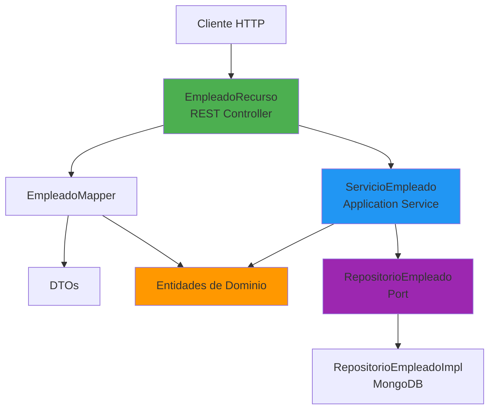

# Endpoints de Empleado - API REST

## Resumen

Se han creado exitosamente los endpoints REST para el servicio de gestión de empleados y se ha configurado Swagger UI para la documentación de la API.

## Cambios Realizados

### 1. DTOs Creados

Se crearon los siguientes DTOs en el paquete `devbitsve.infraestructura.rest.dto`:

#### DTOs de Información
- [InformacionPersonalDTO.java](file:///c:/Users/marco/Documents/ADA/personal-empleados/src/main/java/devbitsve/infraestructura/rest/dto/InformacionPersonalDTO.java) - Datos personales del empleado
- [InformacionContactoDTO.java](file:///c:/Users/marco/Documents/ADA/personal-empleados/src/main/java/devbitsve/infraestructura/rest/dto/InformacionContactoDTO.java) - Datos de contacto
- [InformacionLaboralDTO.java](file:///c:/Users/marco/Documents/ADA/personal-empleados/src/main/java/devbitsve/infraestructura/rest/dto/InformacionLaboralDTO.java) - Información laboral y cargos

#### DTOs de Request/Response
- [CrearEmpleadoRequest.java](file:///c:/Users/marco/Documents/ADA/personal-empleados/src/main/java/devbitsve/infraestructura/rest/dto/CrearEmpleadoRequest.java) - Request para crear empleado
- [EmpleadoResponse.java](file:///c:/Users/marco/Documents/ADA/personal-empleados/src/main/java/devbitsve/infraestructura/rest/dto/EmpleadoResponse.java) - Response con datos completos del empleado

---

### 2. Mapper de Entidades

Se creó [EmpleadoMapper.java](file:///c:/Users/marco/Documents/ADA/personal-empleados/src/main/java/devbitsve/infraestructura/rest/mapper/EmpleadoMapper.java) que proporciona:

- Conversión bidireccional entre DTOs y objetos de dominio
- Métodos para mapear información personal, contacto y laboral
- Conversión de entidades `Empleado` a `EmpleadoResponse` con historial completo

---

### 3. Controlador REST

Se creó [EmpleadoRecurso.java](file:///c:/Users/marco/Documents/ADA/personal-empleados/src/main/java/devbitsve/infraestructura/rest/recurso/EmpleadoRecurso.java) con los siguientes endpoints:

#### Endpoints de Consulta
- `GET /api/empleados` - Obtener todos los empleados
- `GET /api/empleados/{id}` - Obtener empleado por ID
- `GET /api/empleados/documento/{documentoIdentidad}` - Buscar por documento
- `GET /api/empleados/estado/{estado}` - Filtrar por estado (ACTIVO, INACTIVO, LICENCIA)
- `GET /api/empleados/departamento/{departamento}` - Filtrar por departamento

#### Endpoints de Creación y Actualización
- `POST /api/empleados` - Crear nuevo empleado
- `PUT /api/empleados/{id}/informacion-personal` - Actualizar información personal
- `PUT /api/empleados/{id}/informacion-contacto` - Actualizar información de contacto
- `PUT /api/empleados/{id}/cambiar-cargo` - Cambiar cargo del empleado

#### Endpoints de Gestión de Estado
- `PUT /api/empleados/{id}/estado/{estado}` - Cambiar estado
- `PUT /api/empleados/{id}/desactivar` - Desactivar empleado
- `PUT /api/empleados/{id}/reactivar` - Reactivar empleado
- `PUT /api/empleados/{id}/licencia` - Poner en licencia

#### Endpoints de Eliminación
- `DELETE /api/empleados/{id}` - Eliminar empleado

Todos los endpoints incluyen:
- ✅ Anotaciones OpenAPI para documentación
- ✅ Manejo de errores con respuestas apropiadas
- ✅ Códigos de estado HTTP correctos
- ✅ Validación de datos

---

### 4. Configuración de Swagger

Se actualizó [application.properties](file:///c:/Users/marco/Documents/ADA/personal-empleados/src/main/resources/application.properties) con:

```properties
# OpenAPI / Swagger Configuration
quarkus.smallrye-openapi.path=/openapi
quarkus.swagger-ui.always-include=true
quarkus.swagger-ui.path=/swagger-ui
mp.openapi.extensions.smallrye.info.title=API de Gestión de Personal
mp.openapi.extensions.smallrye.info.version=1.0.0
mp.openapi.extensions.smallrye.info.description=API REST para la gestión de empleados y personal
mp.openapi.extensions.smallrye.info.contact.name=DevBitsVE
mp.openapi.extensions.smallrye.info.contact.email=contacto@devbitsve.com

# CORS Configuration (para desarrollo)
quarkus.http.cors=true
quarkus.http.cors.origins=*
quarkus.http.cors.methods=GET,POST,PUT,DELETE,OPTIONS
quarkus.http.cors.headers=accept,authorization,content-type,x-requested-with
```

---

## Verificación

### Compilación
✅ La aplicación compiló exitosamente sin errores

### Swagger UI
✅ Swagger UI está accesible en: http://localhost:8080/swagger-ui/


### Demostración de Swagger UI


---

## URLs Importantes

- **Swagger UI**: http://localhost:8080/swagger-ui/
- **OpenAPI Spec**: http://localhost:8080/openapi
- **API Base**: http://localhost:8080/api/empleados

---

## Próximos Pasos Sugeridos

1. **Validación de DTOs**: Agregar anotaciones de validación Jakarta Bean Validation (`@NotNull`, `@Email`, etc.)
2. **Pruebas**: Crear tests de integración para los endpoints
3. **Seguridad**: Implementar autenticación y autorización
4. **Paginación**: Agregar soporte de paginación para listados grandes
5. **Filtros avanzados**: Implementar búsquedas más complejas

---

## Arquitectura Implementada



La arquitectura sigue el patrón hexagonal:
- **Capa de Infraestructura (REST)**: DTOs, Mapper, Controladores
- **Capa de Aplicación**: Servicios que orquestan casos de uso
- **Capa de Dominio**: Entidades y lógica de negocio
- **Capa de Persistencia**: Implementación de repositorios
